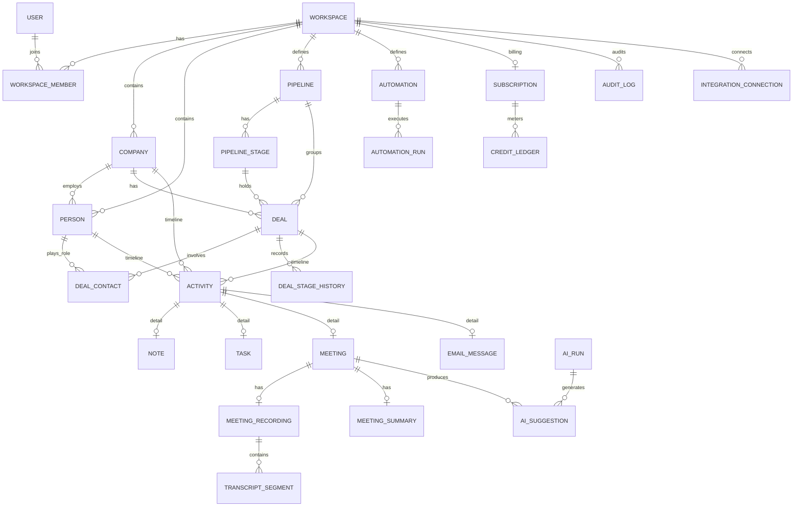
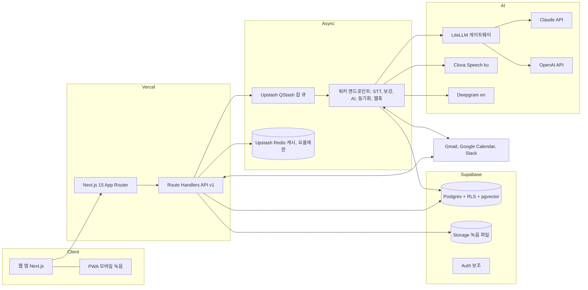

# dacrm AI CRM 고도화 통합 기획서

## 0 문서 정보

| 항목 | 내용 |
|---|---|
| 문서 버전 | v0.2.1 |
| 작성일 | 2026-08-11 |
| 상태 | 확정 (구현 착수 기준 문서) |
| 범위 | 시장조사, PRD, IA, 데이터 모델, 아키텍처 설계, 테스트 설계, 실행 로드맵 |
| 선행 문서 | dacrm PRD v0.4, 본 기획서 v0.1.0 (모두 본 문서로 대체) |
| 제품 성격 | 내부 시스템 탑재형 도구 (외부 판매용 SaaS 아님, 과금 없음) |
| 버전 규칙 | 문서와 코드 모두 v0.0.0 semver, 커밋 메시지에 동일 버전 기록, 모든 변경은 롤백 가능 |

v0.2.1 개정 요지 (v0.2.0 대비)

- 탑재 호스트 확정: 데이터얼라이언스 내부 업무 시스템(자체 구축, 운영 중), 별도 앱 임베드가 아니라 동일 앱 내 모듈(/crm 라우트 그룹)로 탑재 확정(D-08)
- 사이드바 IA 확정: 프로젝트관리 영역을 CRM 섹션으로 확장, 하위 메뉴 8종(4.5)
- 기존 기능 중복 정리 원칙 신설: 회의노트는 CRM 미팅으로 통합, 업무는 원본 분리 후 홈 위젯 합산, 영업 성격 프로젝트 항목은 딜로 이관(4.5)

v0.2.0 개정 요지 (v0.1.0 대비)

- 제품 성격 전환: 외부 판매 SaaS에서 내부 시스템 탑재형 도구로 확정, 구독과 결제와 마케팅 사이트 범위 전면 제거
- 오픈 이슈 확정: AI 5축은 3.6 정의 채택, Lead 엔터티 미도입, RLS 이중 방어 표준 확정 (10장)
- 설정 관리 원칙 반영: env 파일 최소화, 설정은 DB 저장과 관리 UI로 운영
- 제품 원칙 추가: 수동 생성 필수 입력 3필드 이하

전제와 한계

- 현재 구현 상태는 PRD v0.4와 기존 논의 기준으로 정리, 실제 코드 기준 재검증 필요
- 본 문서의 시장 수치는 2026-08-11 기준 공개 자료, 출처는 부록 B에 명시 (내부 도구 전환 후에도 기능 수준 벤치마크 근거로 유지)
- AI 5축 추론은 3.6 정의로 확정, 기존 코드의 축 정의와 다른 부분은 3.6 기준으로 이관
- 탑재 호스트는 데이터얼라이언스 내부 시스템으로 확정(v0.2.1), 동일 앱 모듈이므로 인증은 호스트 세션을 그대로 사용

---

## 1 배경과 문제 정의

### 1.1 현재 상태 (v0.4 기준)

- 원터치 파이프라인 생성: 텍스트 입력에서 파이프라인 항목 자동 생성
- Meeting Mode: 음성 녹음과 STT 기반 미팅 기록
- AI 5축 동시 추론: 미팅과 입력 데이터에서 다축 정보 동시 추출
- 갭필 모달: AI가 못 채운 필드를 사용자에게 최소 질문으로 보완
- React Flow + dagre 프로세스 다이어그램: 영업 프로세스 시각화 (핵심 차별점)

### 1.2 현재 수준의 구조적 한계

- 기록 도구 수준: 데이터를 넣는 도구이지 영업을 실행하는 시스템이 아님
- 데이터 모델 미성숙: 객체 간 관계, 제약, 삭제 정책, 중복 방지, 이력 관리가 정의되지 않음
- 단일 사용자 전제: 팀, 권한, 소유권, 감사 로그 부재
- 자동 캡처 부재: 이메일, 캘린더, 통화가 수동 입력에 의존, CRM 실패의 최대 원인
- AI가 일회성 추론에 머무름: 제안, 실행, 검증, 학습의 루프가 없음
- 운영 통제 부재: AI 사용량과 비용을 관리할 예산, 설정 체계 없음
- 글로벌 준비 부재: 다국어, 다중 통화, 규정 대응 없음

### 1.3 목표 선언

- dacrm을 기록 시스템(System of Record)에서 실행 시스템(System of Action)으로 격상
- 데이터 정합성과 관계 명확성에서 글로벌 상위 제품과 동등 이상 수준 확보
- AI가 데이터를 채우고 사람은 판단만 하는 제로 입력(Zero-Input) CRM 구현
- 내부 영업 조직(Data Alliance, KDC) 실사용으로 검증, 외부 상용화는 범위 제외(별도 의사결정 전까지)

---

## 2 시장조사와 분석

### 2.1 시장 규모와 성장

| 구분 | 수치 | 출처 |
|---|---|---|
| 글로벌 CRM 시장 2026 | 약 126.2B USD, 2034년 321B USD 전망, CAGR 12.4% | Fortune Business Insights |
| 글로벌 CRM 시장 (보수 산정) | 2024년 73.4B USD, 2030년 163.2B USD, CAGR 14.6% | Grand View Research |
| AI in CRM 시장 | 2025년 11.0B에서 2026년 15.1B USD, CAGR 36.4%, 2030년 51.7B 전망 | The Business Research Company |
| AI in Sales 시장 | 2025년 8.8B에서 2032년 63.5B USD, CAGR 32.6% | PS Market Research |
| CRM 도입률 | 미국 직원 10인 이상 기업 91% 도입, 10인 미만은 약 50% | SellersCommerce, DemandSage |
| 성장 동력 | AI 기능 레이어, SME 세그먼트, 아시아태평양이 성장 견인 | Fortune Business Insights 외 |

시사점

- 전체 CRM은 성숙 시장이나 AI 레이어는 CAGR 30%대의 초기 고성장 구간
- 성장이 집중되는 곳이 정확히 dacrm의 타깃: AI 기능, SME, 아시아태평양
- 한국은 도입률 자체가 낮아(세일즈맵 스스로 "비어있는 시장"으로 규정) 신규 창출 여지가 큼

### 2.2 경쟁 구도

#### 2.2.1 글로벌 레거시 (AI를 얹은 기존 CRM)

| 제품 | AI 전략 | 강점 | 약점 |
|---|---|---|---|
| Salesforce Agentforce | 자율 에이전트 플랫폼, Q3 FY2026 기준 ARR 540M USD, 고객 18,500+, 월 30억 건 에이전트 워크플로우, Atlas Reasoning Engine이 OpenAI, Anthropic, Gemini 모델 선택 지원 | 생태계, Data Cloud, 관측성(Command Center) | 복잡한 셋업, 높은 총비용(미드마켓 1년차 6자리 달러 사례), 레거시 아키텍처 제약 |
| HubSpot Breeze | Assistant + Agents(Prospecting, Customer) + Intelligence(보강, 구매 의도), 고객 279,000+, 최초로 프로덕션급 MCP 서버 공개 | 무료 티어, 빠른 배포, 올인원 | 크레딧 과금 불만(엔트리 500 크레딧 제한), 복잡한 엔터프라이즈 워크플로우에 부적합 |
| Microsoft Dynamics, Zoho, Pipedrive, Creatio | Copilot, Zia, AI 애드온 | 각 세그먼트 가성비 | AI가 부가 기능 수준 |

#### 2.2.2 글로벌 AI 네이티브 (에이전트 전제 설계)

| 제품 | 특징 | 참고 |
|---|---|---|
| Attio | 프로그래머블 데이터 모델, 커스텀 객체, AI Attributes(필드를 AI가 자동 채움), 웹 리서치 에이전트, MCP 40+ 툴 | Lovable, Granola, Modal 등 AI 기업이 채택, 업마켓 이동으로 복잡도와 가격 상승 중 |
| Clarify | 제로 입력 보강, 자동 갱신 딜, 수동 입력 80% 감소 사례 | Series A 초기, 단일 파이프라인 자동화 |
| Coffee | 완전 자율 데이터 입력 에이전트, 단독 CRM 또는 기존 CRM 컴패니언 이중 모드 | SMB 집중 |
| Conduyt | 에이전트를 1급 사용자로 설계: 스키마 API, MCP 104 툴, 에이전트별 액션 예산, 스코프 권한, 에이전트 감사 로그, 정액제 | AI 퍼스트 팀 타깃 |

#### 2.2.3 인접 스택 (CRM이 흡수 중인 기능)

| 영역 | 대표 제품 | 가격 감각 |
|---|---|---|
| 데이터 보강 | Clay (150+ 데이터 소스 워터폴 보강) | 월 134~720 USD, 크레딧 실비용 상회 경향 |
| 대화 인텔리전스 | Gong (딜 리스크, 코칭) | 유저당 연 1,360~1,600 USD + 플랫폼 비용 |
| 포캐스트, RevOps | Clari + Salesloft (2025-12 합병, ARR 450M) | 유저당 월 140~180 USD |
| 미팅 노트 | Fathom, Fireflies, Granola | 무료~저가, 개인 도구로 확산 |
| AI SDR | Artisan 등 | 월 2,000~5,000 USD 이상 |

#### 2.2.4 국내

| 제품 | 특징 |
|---|---|
| 세일즈맵 | 2023년 설립 KAIST 팀, AI Native CRM 포지셔닝, AI 영업 동반자 "세일로", 프리A 10억 유치, 온보딩 평균 2주, Slack, Teams, 잔디 연동, ISO 27001, AI가 읽기 쉬운 API 문서로 고객사가 직접 에이전트 구축 |
| 릴레이트 | 국내 출발 글로벌 지향 B2B CRM, 심플 파이프라인 중심 |
| 세일즈인사이트 | 국내 수주, 입찰, 관계 중심 영업 조직 특화 |
| 해외 제품 국내 사용 | HubSpot, Salesforce는 온보딩 난이도와 한국어 지원 한계로 중소 조직 정착률 낮음 |

### 2.3 카테고리 이동: 기록에서 실행으로

시장이 합의 중인 AI 네이티브 CRM의 기준 (2026 기준 사실상 표준 요건)

- 자동 캡처: 이메일, 캘린더, 미팅에서 사람 개입 없이 데이터 생성
- AI 속성: 임의 객체의 임의 필드를 AI가 근거와 함께 자동 채움
- 에이전트 실행: 제안을 넘어 스코프 권한과 예산 안에서 직접 실행하고 로그를 남김
- 에이전트 인터페이스: MCP 서버, 스키마 API, 모델 선택권(BYO Model)
- 신뢰 장치: 에이전트 행동의 감사 추적, 사람 승인(HITL), 출처(provenance) 표기

### 2.4 dacrm 포지셔닝과 승부처

포지셔닝 문장

- 미팅에서 시작해 프로세스로 실행되는 AI 네이티브 CRM
- 한국어 영업 대화를 가장 잘 이해하고, 데이터 정합성을 가장 신뢰할 수 있는 CRM

승부처 3가지

1. 미팅 중심 캡처: 국내 B2B 영업의 핵심 접점은 대면, 유선 미팅. Meeting Mode를 Gong 수준의 대화 인텔리전스로 격상. 글로벌 AI CRM 대부분이 미팅 봇 미보유(Attio 포함)일 만큼 난도가 높은 영역
2. 프로세스 다이어그램: React Flow 기반 영업 프로세스 시각화는 보드 뷰 일색인 경쟁 제품과 구분되는 고유 자산. 프로세스 정의가 곧 자동화와 에이전트의 실행 규칙이 되도록 승격
3. 정합성 우선 설계: AI가 데이터를 만들수록 오염 위험이 커짐. 출처, 신뢰도, 승인 상태를 스키마 수준에서 관리하는 정합성 아키텍처를 차별점으로 명시 (경쟁 제품 대부분이 약한 지점)

전략적 선택

- 사용 범위: 내부 영업 조직(Data Alliance, KDC)이 유일한 사용자, 내부 시스템에 탑재해 운영
- 시장조사의 용도: 판매 전략이 아니라 기능 수준의 기준선, 위 경쟁 제품과 동등 이상의 사용 경험을 내부 도구로 확보하는 것이 목표
- 상용화: 내부 검증에서 자동화율과 수락률 목표를 달성한 이후 별도 의사결정, 본 문서 범위 제외

---

## 3 제품 정의 (PRD)

### 3.1 비전과 전략

- 비전: 영업팀이 CRM에 데이터를 입력하는 시간이 0에 수렴하고, CRM이 다음 행동을 실행해 주는 상태
- 미션: 미팅 한 번이 끝나면 고객, 딜, 다음 할 일, 후속 메일 초안까지 CRM이 스스로 준비
- 단계 전략: 1단계 내부 영업 조직 실사용 정착(엑셀과 수기 기록 폐기), 2단계 내부 시스템 탑재와 데이터 연동 확산, 3단계 외부 상용화 여부 별도 판단

### 3.2 타깃과 페르소나

| 페르소나 | 역할 | 핵심 페인 | dacrm이 주는 것 |
|---|---|---|---|
| P1 영업 담당 (AE) | 미팅, 제안, 클로징 실무 | 미팅 후 기록 귀찮음, 팔로업 누락, 히스토리 파편화 | 녹음만 하면 기록 완료, 다음 액션 자동 생성 |
| P2 영업 리더 | 파이프라인 관리, 코칭, 포캐스트 | 보고용 취합 노동, 딜 리스크를 뒤늦게 인지 | 실시간 파이프라인, 딜 리스크 조기 경보, 주간 리뷰 자동화 |
| P3 대표 겸 영업 (Founder-led Sales) | 영업과 경영 겸임 | 도구 셋업할 시간 없음, 혼자서 전 과정 수행 | 10분 온보딩, 에이전트가 SDR과 어시스턴트 역할 대행 |

- 초기 집중: P3와 P1, 내부 실사용자의 실제 역할과 일치(대표 겸 영업 수행, 담당 실무)
- P2 관점(파이프라인 관리, 포캐스트)은 Phase 2부터 본격 대응

### 3.3 핵심 가치 제안 (JTBD)

- Job 1 기록: 고객과의 모든 접점이 자동으로 남는다 (이메일, 캘린더, 미팅, 메모)
- Job 2 판단: 어떤 딜이 위험하고 오늘 무엇을 해야 하는지 알려준다
- Job 3 실행: 후속 메일, 일정 제안, 리서치를 CRM이 대신 수행하고 승인만 받는다
- Job 4 보고: 리더와 대표가 보는 리포트가 사람 손 없이 항상 최신이다

### 3.4 제품 원칙

1. 제로 입력: 사람이 타이핑하는 모든 필드는 제거 대상, 입력은 승인으로 대체
2. 정합성 우선: 빠른 기능보다 깨지지 않는 데이터, 모든 쓰기는 검증과 이력을 동반
3. 사람이 최종 승인: AI 쓰기는 기본적으로 제안 상태, 자동 반영은 사용자가 명시적으로 허용한 범위만
4. 설명 가능: AI가 만든 모든 값은 출처, 근거, 신뢰도를 함께 보관하고 UI에 표기
5. 프로세스가 곧 규칙: 다이어그램으로 그린 영업 프로세스가 자동화와 에이전트의 실행 규칙
6. 필수 입력 3필드 이하: 모든 객체의 수동 생성 필수 입력은 3개를 넘지 않음, 나머지는 AI 제안과 자동 캡처로 채움

### 3.5 기능 요구사항

우선순위 표기: P0 필수(없으면 출시 불가), P1 중요(초기 3개월 내), P2 확장

#### FR-01 코어 객체와 레코드 관리 (P0)

- 표준 객체: Company, Person, Deal, Pipeline, Stage, Activity(Note, Task, Meeting, Email, Call)
- 모든 객체 공통: 소유자, 생성과 수정 이력, 소프트 삭제와 복구, 태그
- 레코드 페이지 표준 3열 레이아웃: 좌측 속성, 중앙 타임라인, 우측 AI 패널과 연관 레코드
- 리스트 뷰 시스템: 필터, 정렬, 컬럼 선택, 저장된 뷰, 테이블과 보드 전환
- 인라인 편집, 벌크 편집, 벌크 삭제(휴지통 경유)

#### FR-02 파이프라인과 프로세스 (P0, 핵심 차별화)

- 다중 파이프라인 (신규 영업, 갱신, 파트너십 등 분리)
- 스테이지 정의: 순서, 성공 확률, 유형(진행, 성공, 실패), 필수 필드(스테이지 진입 조건)
- 칸반 보드 드래그 이동, 이동 시 히스토리 자동 기록
- 프로세스 다이어그램(React Flow + dagre): 스테이지, 조건 분기, 자동화 노드를 하나의 캔버스로 시각화
- 다이어그램에서 정의한 조건이 실제 검증 규칙과 자동화 트리거로 동작 (그림과 로직의 단일 원천)
- 원터치 파이프라인 생성 유지: 텍스트, 명함, 미팅에서 딜과 연락처 일괄 생성

#### FR-03 활동 자동 캡처 (P0)

- Gmail 연동: 연락처와 매칭되는 이메일 자동 로깅, 스레드 단위 타임라인 표시
- Google Calendar 연동: 미팅 일정 자동 인식, 종료 후 기록 유도
- 수동 활동: 전화 메모, 노트, 파일 첨부
- 캡처 제외 규칙: 개인 이메일 도메인 제외 목록, 특정 연락처 제외

#### FR-04 Meeting Mode 2.0 (P0, 핵심 차별화)

- 녹음: 브라우저와 모바일(PWA) 녹음, 파일 업로드 병행
- STT: 한국어 화자 분리 지원, 영어 병행 (벤더 추상화, 6.6 참조)
- 산출물 파이프라인: 전사 → 요약 → 구조화 추출(AI 5축) → 제안 생성 → 사용자 승인 → CRM 반영
- 추출 항목: 참석자, 논의 주제, 고객 니즈, 예산과 일정 신호, 경쟁 언급, 리스크, 합의 사항, 다음 액션
- 승인 UX: 갭필 모달 확장, 추출값을 필드 단위로 수락, 수정, 거절
- 미팅 상세 페이지: 오디오 플레이어, 전사 구간 클릭 시 해당 시점 재생, 요약과 액션 아이템

#### FR-05 AI 코어 (P0~P1)

- AI 5축 동시 추론 정식화 (3.6 참조)
- AI 속성(AI Attributes): 관리자가 임의 필드에 프롬프트를 지정하면 AI가 근거와 함께 자동 채움 (예: ICP 등급, 요약, 산업 분류) (P1)
- 딜 인텔리전스: 딜 건강 점수, 정체 감지(스테이지 체류 초과), 리스크 사유, 다음 최선 행동 제안 (P1)
- 어시스턴트: 자연어로 CRM 조회와 조작 ("이번 주 팔로업 없는 딜 보여줘") (P1)
- 에이전트 v1 (P1): 미팅 후속 메일 초안, 딜 리서치(회사 뉴스, 인물 배경), 주간 파이프라인 리뷰 리포트
- 에이전트 실행 원칙: 스코프 권한, 실행 예산(토큰과 월 ai_budget), 전 행동 감사 로그, 기본은 제안 후 승인

#### FR-06 데이터 보강 (P1)

- 회사 보강: 도메인 기반 웹 리서치 에이전트(홈페이지, 뉴스), 국내 사업자 정보 조회
- 인물 보강: 이메일 서명 파싱, 공개 프로필 검색
- 모든 보강 값은 출처와 수집 시각을 저장, 기존 수동 입력 값을 덮어쓰지 않고 제안으로 병합

#### FR-07 데이터 품질 (P0)

- 중복 방지: 회사는 도메인, 인물은 이메일 정규화 기준 생성 시점 차단과 병합 유도
- 중복 후보 감지: 유사도 기반 백그라운드 스캔, 검토 큐 제공
- 병합: 필드 생존 규칙 선택, 관련 레코드 참조 전부 재연결, 병합 로그 보관
- 검증 규칙: 필수 필드, 형식(이메일, 전화, URL), 스테이지 진입 조건

#### FR-08 자동화 워크플로우 (P1)

- 트리거: 레코드 생성과 변경, 스테이지 이동, 시간 경과(체류 N일), 미팅 종료, 폼 제출
- 조건: 필드 비교, 소유자, 파이프라인
- 액션: 태스크 생성, 필드 변경, 알림, 이메일 초안 생성, 웹훅 호출, AI 액션 실행
- 실행 이력과 실패 재시도, 프로세스 다이어그램과 동일 캔버스에서 편집

#### FR-09 리포트와 포캐스트 (P1)

- 기본 대시보드: 파이프라인 총액과 단계별 분포, 기간별 신규와 성사, 전환율, 영업 사이클 길이, 활동량
- 포캐스트: 스테이지 확률 가중 예상 매출, 기간 필터, 담당자별
- 다중 통화 합산: 워크스페이스 기본 통화로 환산(환율 스냅샷)
- 리더용 주간 리뷰: AI가 변동 사항과 리스크를 서술형으로 요약

#### FR-10 검색과 커맨드 팔레트 (P1)

- 전역 검색: 이름, 이메일, 도메인, 노트 본문
- 커맨드 팔레트(Cmd+K): 이동, 생성, AI 명령 실행

#### FR-11 팀과 권한 (P0)

- 워크스페이스 멤버 초대, 역할: Owner, Admin, Member, ReadOnly
- 레코드 소유자와 담당자, 소유권 이전
- 권한 매트릭스는 6.8에 정의, 설정 변경은 Admin 이상

#### FR-12 알림 (P1)

- 인앱 알림 센터, 이메일 다이제스트
- Slack 연동: 딜 성사, 스테이지 변경, 멘션 (P2에 Teams, 잔디 검토, 국내 협업툴 연동은 세일즈맵 대비 필수 대응 항목)

#### FR-13 임포트와 엑스포트 (P0)

- CSV, 엑셀 임포트: 컬럼 매핑, 중복 정책(건너뛰기, 갱신, 병합), 오류 리포트, 롤백
- 엑스포트: 뷰 기준 CSV, 전체 백업 다운로드
- 마이그레이션 프리셋: 엑셀 관리 대장, 노션, HubSpot 내보내기 포맷

#### FR-14 커스텀 필드와 커스텀 객체 (P1, P2)

- 커스텀 필드(P1): 텍스트, 숫자, 통화, 날짜, 선택, 다중 선택, 사용자, URL, 체크박스
- 커스텀 객체(P2): 표준 객체와 동일한 뷰, 관계, 자동화 지원 (Attio 대응 항목)

#### FR-15 API, 웹훅, MCP (P1~P2)

- 공개 REST API: API 키 발급, 스코프, 요율 제한 (P1)
- 웹훅 발신: 주요 이벤트 구독, 서명 검증, 재시도 (P1)
- MCP 서버(P2): 외부 AI 에이전트가 dacrm을 도구로 사용, 읽기와 쓰기 스코프 분리 (AI 네이티브 CRM의 표준 요건이자 국내 선점 기회)

#### FR-16 내부 시스템 탑재 (P0, 비용 관리는 3.8)

- 탑재 호스트 확정: 데이터얼라이언스 내부 업무 시스템(자체 구축 운영 중, 업무, 캘린더, 회의노트, 조직도, AI 채팅, 프로젝트관리, GPU 관리 등 보유)
- 탑재 방식 확정(D-08): 별도 앱 임베드가 아니라 호스트와 동일 Next.js 앱 내 모듈(라우트 그룹 /crm/*)로 구현, 사이드바 CRM 섹션에서 진입
- 인증: 호스트 로그인 세션을 그대로 사용(별도 로그인 없음), CRM 역할(6.8)은 호스트 사용자에 매핑, Gmail과 Calendar OAuth는 로그인과 별개로 사용자별 연결 플로우 수행
- 데이터: 동일 Postgres 안에서 crm 전용 스키마(또는 테이블 프리픽스)로 경계 유지, 호스트 조직도의 사용자와 부서를 참조해 담당자 지정
- 연동: 타 내부 모듈이 쓰는 내부 API(6.4)와 웹훅, MCP 서버는 내부 에이전트(CEO Agent) 연동용
- 과금, 구독, 플랜 개념 없음: 사용 통제는 AI 예산(3.8)과 권한(6.8)으로만 수행

#### FR-17 다국어 (P2)

- 내부 도구로 ko 단일 운영, 단 문자열은 처음부터 외부화(i18n 구조)해 향후 상용화 시 재작업 방지
- AI 산출물 언어: 워크스페이스 기본 언어 설정 따름, 미팅 전사는 원문 유지
- 날짜, 통화, 숫자 로캘 처리는 P0(달러 거래가 실무 기본이므로 통화만은 즉시 필요)

#### FR-18 온보딩 (P0)

- 워크스페이스 생성 후 10분 내 첫 가치 도달: 샘플 데이터 없이 실데이터로 시작
- 3단계 온보딩: 파이프라인 템플릿 선택 → 이메일과 캘린더 연결 → 첫 미팅 녹음 또는 기존 데이터 임포트
- 파이프라인 템플릿: 내부 실영업 유형 기준(GPU 인프라 세일즈, 파트너십, 공공 수주, KDC 제품 영업)

#### FR-19 설정 관리 (P0)

- 원칙: env 파일은 부트스트랩 시크릿(DB 접속, 암호화 마스터 키, 호스트 인증 시크릿)만, 그 외 모든 설정은 DB 저장과 관리 UI로 운영
- 대상: LLM 모델과 라우팅 정책, STT 벤더 선택, AI 예산 상한, auto_apply 허용 필드, 기능 플래그, 알림 채널, 보관 기간
- 설정 변경은 감사 로그 기록, 시크릿 성격 값은 암호화 저장(6.8), 변경 즉시 반영(재배포 불필요)
- 전역(global)과 워크스페이스 스코프 2단, 워크스페이스 값이 전역 값을 오버라이드

### 3.6 AI 5축 동시 추론 정식화 (확정)

"AI 5축 동시 추론"을 아래 5축으로 확정, 모든 AI 파이프라인의 표준 출력 스키마로 고정 (기존 코드의 축 정의가 다르면 본 정의 기준으로 이관)

| 축 | 이름 | 추출 내용 | 반영 대상 |
|---|---|---|---|
| 1 | 관계 (Who) | 회사, 인물, 직책, 역할(챔피언, 결정권자, 실무, 반대자), 조직 관계 | Company, Person, DealContact |
| 2 | 기회 (What) | 딜 존재, 제품과 범위, 금액 신호, 통화 | Deal, DealLineItem |
| 3 | 진행 (Where) | 현재 스테이지 판단, 진입 조건 충족 여부, 다음 마일스톤 | Deal.stage, StageHistory |
| 4 | 신호 (Risk) | 예산, 일정, 경쟁, 이탈, 온도 변화 등 긍정과 부정 신호 | DealSignal, 딜 건강 점수 |
| 5 | 행동 (Next) | 다음 액션, 기한, 담당, 후속 메일 요지 | Task, AISuggestion |

- 출력은 5축 고정 JSON 스키마로 강제, 스키마 불일치 시 재시도(6.6)
- 축별 신뢰도(confidence)와 근거 문장(전사 구간 참조)을 필수 포함

### 3.7 비기능 요구사항

| 영역 | 요구 수준 |
|---|---|
| 성능 | 주요 목록과 레코드 페이지 P95 응답 500ms 이하, 검색 P95 1초 이하, 미팅 60분 전사 완료 10분 이내 |
| 규모 | 워크스페이스당 회사 10만, 인물 30만, 활동 300만 건에서 성능 유지 |
| 가용성 | 월 99.9% 목표, 계획 점검 사전 공지 |
| 보안 | 전 구간 TLS, 저장 시 암호화, OAuth 토큰 별도 암호화, RBAC와 테넌트 격리(6.8) |
| 규정 | 개인정보보호법(국내), GDPR 대비 설계(삭제권, 반출권은 FR-13으로 충족), 녹음 동의 고지 기능 |
| 감사 | 모든 쓰기 작업과 에이전트 행동의 감사 로그 1년 보관 |
| 백업 | 일 1회 전체, 시점 복구(PITR) 활성화 |
| 접근성 | 키보드 내비게이션, 명도 대비 WCAG AA 지향 |

### 3.8 AI 비용 관리 (과금 없음)

원칙: 내부 도구이므로 요금과 플랜 개념을 두지 않음, 대신 AI 원가(LLM, STT, 보강 API)를 투명하게 관측하고 예산으로 통제

- 원가 관측: 모든 AI 호출은 ai_run에 토큰과 비용을 기록, 워크스페이스와 기능(kind)별 월간 집계를 설정 화면에 상시 표시
- 예산 통제: 워크스페이스별 월 예산 상한(ai_budget)을 DB 설정으로 관리, 80% 도달 시 경보, 100% 도달 시 AI 기능만 소프트 차단(코어 CRM 읽기와 쓰기는 계속 동작), Admin이 상한 상향으로 즉시 해제
- 비용 절감 장치: 모델 티어 라우팅(6.6.1), 미팅 전사 캐시 재사용, 보강 결과 30일 캐시
- 참고: 상용화를 재개할 경우에만 과금 설계를 별도 문서로 신규 작성 (본 문서에 포함하지 않음)

### 3.9 성공 지표

| 구분 | 지표 | 목표 (출시 후 6개월) |
|---|---|---|
| 북극성 | 주간 자동 생성 활동 수 / 전체 활동 수 (자동화율) | 70% 이상 |
| 활성 | 주간 활성 워크스페이스(WAW), 미팅 AI 주 1회 이상 사용 비율 | 40% 이상 |
| 가치 도달 | 온보딩 후 첫 미팅 분석 완료까지 시간 | 중앙값 1일 이내 |
| 내부 채택 | 내부 영업 활동의 dacrm 단일 기록률(엑셀, 수기 병행 제거) | 100% (병행 기록 0건) |
| 신뢰 | AI 제안 수락률, 필드 정정률 | 수락률 60% 이상, 정정률 10% 이하 |

### 3.10 범위 제외 (Non-goals)

- 구독, 결제, 플랜, 크레딧 과금: 내부 도구이므로 구축하지 않음 (상용화 재개 시 별도 문서)
- 마케팅 사이트, SEO, AEO, GEO: 외부 노출 없음, 구축하지 않음
- 마케팅 자동화(대량 메일 캠페인), 고객 지원 티케팅: 연동으로 해결, 자체 구축하지 않음
- 아웃바운드 콜드메일 대량 발송: 도메인 평판과 규제 리스크, AI SDR 전문 도구 영역
- 온프레미스 설치형: 제공하지 않음
- 네이티브 모바일 앱: Phase 3까지는 PWA로 대응

---

## 4 IA (정보 구조)

### 4.1 IA 원칙

- 객체 중심: 모든 화면은 객체(회사, 인물, 딜, 미팅)의 리스트 뷰 아니면 레코드 페이지, 예외를 만들지 않음
- 레코드 페이지 표준화: 어떤 객체든 좌측 속성, 중앙 타임라인, 우측 AI와 연관 레코드의 동일 구조
- 이동 최소화: 우측 사이드 피크(peek)로 리스트를 떠나지 않고 레코드 열람
- AI는 어디에나: 전 화면 우측 AI 패널 호출 가능, 컨텍스트는 현재 화면의 객체

### 4.2 앱 사이트맵

동일 앱 모듈 확정(v0.2.1)에 따라 아래 전 경로는 호스트 앱의 /crm 프리픽스 하위에 배치(예: /crm/deals)

```
/ (홈, 오늘 화면)
├── /inbox              알림, 승인 대기(AI 제안, 중복 검토)
├── /companies          회사 리스트
│   └── /companies/[id] 회사 레코드
├── /people             인물 리스트
│   └── /people/[id]    인물 레코드
├── /deals              딜 (테이블, 보드, 포캐스트 뷰 전환)
│   └── /deals/[id]     딜 레코드
├── /meetings           미팅 리스트, 녹음 시작
│   └── /meetings/[id]  미팅 상세(플레이어, 전사, 요약, 추출 결과)
├── /tasks              내 할 일, 팀 할 일
├── /process            프로세스 다이어그램 캔버스(파이프라인별)
├── /automations        자동화 목록, 실행 이력
├── /reports            대시보드, 포캐스트, 활동 리포트
├── /search             전역 검색 결과
└── /settings
    ├── /settings/workspace        이름, 기본 통화, 기본 언어, 회계 기간
    ├── /settings/members          멤버, 초대, 역할
    ├── /settings/pipelines        파이프라인과 스테이지, 진입 조건
    ├── /settings/fields           객체별 필드, 커스텀 필드
    ├── /settings/ai               AI 속성 정의, 자동 반영 허용 범위, 모델 설정
    ├── /settings/integrations     Gmail, Calendar, Slack, 웹훅, API 키
    ├── /settings/data             임포트, 엑스포트, 중복 검토, 휴지통
    ├── /settings/system           시스템 설정(LLM 모델, STT 벤더, AI 예산, 기능 플래그, 전부 DB 저장)
    └── /settings/audit            감사 로그
```

### 4.3 핵심 화면 정의

| 화면 | 목적 | 핵심 요소 |
|---|---|---|
| 홈(오늘) | 오늘 할 행동 결정 | 오늘 미팅, 기한 도래 태스크, AI 제안 승인 대기, 정체 딜 경보 |
| Inbox | 승인 허브 | AI 제안 카드(수락, 수정, 거절), 중복 병합 검토, 멘션 알림 |
| 딜 보드 | 파이프라인 운영 | 스테이지 칸반, 카드에 금액과 건강 점수, 드래그 이동, 합계 헤더 |
| 딜 레코드 | 딜 실행 | 좌: 금액, 스테이지, 확률, 담당, 우: 관계자 역할 맵, AI 리스크와 다음 행동, 중앙: 타임라인 |
| 미팅 상세 | 미팅 자산화 | 오디오 플레이어와 전사 동기화, 5축 추출 결과, 반영 상태 표시 |
| 프로세스 캔버스 | 프로세스가 곧 규칙 | 스테이지 노드, 조건과 자동화 노드, 시뮬레이션(딜 흐름 표시) |
| 리포트 | 리더 보고 대체 | 기간과 담당 필터, 포캐스트, AI 주간 리뷰 서술 |
| 설정 AI | 신뢰 제어 | 자동 반영 허용 필드 화이트리스트, AI 비용 집계와 예산, 모델 선택 |

### 4.4 URL과 상태 규칙

- 리스트 상태(필터, 정렬, 뷰)는 URL 쿼리에 직렬화, 공유 시 동일 화면 재현
- 저장된 뷰는 /deals?view=[viewId] 형태로 접근
- 피크 패널은 /deals?peek=[dealId]로 표현해 뒤로 가기 자연 동작

### 4.5 내부 탑재 IA (호스트 사이드바 확장)

호스트 사이드바의 프로젝트관리 영역을 CRM 섹션으로 확장, 4.2 사이트맵 경로가 하위 메뉴로 매핑됨

```
CRM (사이드바 섹션)
├── 인박스     /crm/inbox      승인 대기(AI 제안, 중복 검토), 배지 카운트
├── 고객사     /crm/companies
├── 담당자     /crm/people
├── 딜         /crm/deals      테이블, 보드, 포캐스트 뷰
├── 미팅       /crm/meetings   녹음, 전사, 5축 추출
├── 프로세스   /crm/process    파이프라인 다이어그램 캔버스
├── 리포트     /crm/reports
└── CRM 설정   /crm/settings   자동화, 필드, AI, 예산 포함
```

기존 호스트 기능과의 중복 정리(단일 기록 원칙, 3.9 내부 채택 지표의 전제)

- 회의노트: CRM 미팅으로 통합, 기존 회의노트 메뉴는 CRM 미팅으로 연결하고 병행 기록 금지, 고객 미연결 사내 회의도 고객 없이 기록 가능하게 수용
- 업무: 원본 분리, 영업 태스크의 원본은 CRM, 호스트 홈의 부서 업무 위젯에는 호스트 업무와 CRM 태스크를 합산 노출(같은 일의 이중 등록 금지)
- 프로젝트관리: 현행 항목 중 영업 성격(수주 전 안건)은 딜로 이관, 수주 후 수행 관리는 won 딜에서 프로젝트 생성으로 연결(P2)
- 외부 공개 페이지 없음: 마케팅, 랜딩, 요금 페이지 없음, robots 전체 차단, 사용 가이드는 내부 경로로만 제공

---

## 5 데이터 모델과 정합성 설계

본 장이 이번 고도화의 중심. AI가 데이터를 생산하는 제품은 정합성 설계가 없으면 스스로 데이터를 오염시킴

### 5.1 설계 원칙

1. 모든 테이블에 workspace_id: 예외 없음, 전 쿼리는 워크스페이스 스코프 강제
2. 소프트 삭제 기본: deleted_at 컬럼, 30일 보관 후 하드 삭제 배치, 휴지통 복구 제공
3. 이력은 별도 테이블: 현재 상태 테이블과 이력 테이블 분리(StageHistory, AuditLog, MergeLog)
4. AI 산출물은 반드시 출처를 가짐: source, confidence, 근거 참조 없는 AI 쓰기는 스키마 수준에서 금지
5. 금액은 정수 minor unit + 통화 코드: 부동소수점 금지
6. 시간은 UTC 저장: 표시 시 워크스페이스와 사용자 타임존 적용
7. 파생 값은 저장하지 않음이 기본: 합계와 전환율은 쿼리로 계산, 성능상 필요 시 명시적 캐시 테이블로 분리
8. 외부 ID는 원본 그대로 보관: gmail message_id, calendar event_id 등은 유니크 제약으로 중복 동기화 차단

### 5.2 ERD 개요



### 5.3 엔터티 정의

#### 그룹 A 테넌시와 조직

| 테이블 | 핵심 컬럼 | 제약과 비고 |
|---|---|---|
| workspace | id, name, base_currency, default_locale, timezone, deleted_at | 테넌트 루트 |
| user | id, email, name, locale | 전역 사용자, email 유니크 |
| workspace_member | workspace_id, user_id, role(owner, admin, member, readonly), status | (workspace_id, user_id) 유니크, owner 최소 1인 보장 |
| invitation | workspace_id, email, role, token_hash, expires_at, accepted_at | 토큰은 해시 저장 |

#### 그룹 B 코어 CRM

| 테이블 | 핵심 컬럼 | 제약과 비고 |
|---|---|---|
| company | workspace_id, name, domain, industry, size, address, owner_id, source, custom(jsonb), deleted_at | (workspace_id, lower(domain)) 부분 유니크(도메인 존재 시), 도메인은 정규화 저장(스킴과 www 제거) |
| person | workspace_id, company_id(FK, null 허용), first_name, last_name, email, phone, title, lifecycle_stage(lead, mql, sql, customer, inactive), owner_id, source, custom(jsonb), deleted_at | (workspace_id, lower(email)) 부분 유니크, 별도 Lead 테이블을 두지 않고 lifecycle_stage로 통합(전환 시 데이터 복제와 중복의 근원 제거, Attio 방식) |
| pipeline | workspace_id, name, display_order, is_default, deleted_at | 워크스페이스당 1개 이상 보장 |
| pipeline_stage | pipeline_id, name, display_order, probability(0~100), kind(open, won, lost), entry_rules(jsonb) | 파이프라인당 won과 lost 각 1개 이상, kind별 순서 제약 |
| deal | workspace_id, company_id(FK 필수), pipeline_id, stage_id, name, amount_minor(bigint), currency(char3), expected_close_date, status(open, won, lost), won_at, lost_at, lost_reason, owner_id, health_score, custom(jsonb), deleted_at | CHECK: status가 won이면 won_at 필수, lost면 lost_reason 필수, stage_id는 반드시 pipeline_id 소속(복합 FK로 강제) |
| deal_contact | deal_id, person_id, role(champion, decision_maker, user, blocker, other), is_primary | (deal_id, person_id) 유니크, primary는 딜당 최대 1 |
| deal_stage_history | deal_id, from_stage_id, to_stage_id, changed_by(user 또는 agent), changed_at, duration_in_from | 스테이지 변경 트랜잭션에서 항상 함께 기록 |
| product, deal_line_item | (P2) 제품, 단가, 수량 | 견적 기능 확장 시 |

#### 그룹 C 활동과 커뮤니케이션

| 테이블 | 핵심 컬럼 | 제약과 비고 |
|---|---|---|
| activity | workspace_id, type(note, task, meeting, email, call, stage_change, system), company_id, person_id, deal_id, actor_id, occurred_at, deleted_at | CHECK: company_id, person_id, deal_id 중 최소 1개 필수, 타임라인의 단일 진입점 |
| note | activity_id(1:1), body_md | |
| task | activity_id(1:1), title, due_at, assignee_id, status(open, done, canceled), completed_at, origin(manual, ai, automation) | |
| meeting | activity_id(1:1), title, started_at, ended_at, calendar_event_id, location, attendee_emails(jsonb) | calendar_event_id 유니크(중복 동기화 차단) |
| meeting_recording | meeting_id, file_url, duration_sec, status(uploaded, transcribing, transcribed, summarized, failed), stt_vendor, error, retry_count | 상태 머신 5.5.3 |
| transcript_segment | recording_id, seq, speaker_label, started_ms, ended_ms, text | (recording_id, seq) 유니크, 시간 역전 금지 CHECK |
| meeting_summary | meeting_id, summary_md, action_items(jsonb), five_axis(jsonb), model, ai_run_id | 5축 스키마 고정 |
| email_thread, email_message | thread_id, gmail_message_id, from, to, subject, snippet, body_ref, sent_at, direction | (workspace_id, gmail_message_id) 유니크, 본문은 오브젝트 스토리지 참조 |
| calendar_event | workspace_id, external_event_id, start_at, end_at, attendees | external_event_id 유니크 |

#### 그룹 D AI와 데이터 품질

| 테이블 | 핵심 컬럼 | 제약과 비고 |
|---|---|---|
| ai_run | workspace_id, kind(meeting_extract, enrich, agent_task, assistant, field_fill), model, input_ref, output_ref, prompt_version, tokens_in, tokens_out, cost_minor, latency_ms, status(queued, running, done, failed), error | 모든 LLM 호출은 예외 없이 기록, 비용 정산과 평가의 원천 |
| ai_suggestion | workspace_id, ai_run_id, target_type, target_id, field_key, suggested_value(jsonb), current_value_snapshot(jsonb), confidence, evidence(jsonb: 전사 구간 등), status(pending, accepted, rejected, auto_applied, expired), decided_by, decided_at | AI 쓰기의 유일한 관문, 직접 쓰기 금지 |
| ai_field_config | workspace_id, target_type, field_key, prompt, model_tier, refresh_trigger(on_create, on_change, manual), auto_apply(boolean) | AI 속성 정의, auto_apply는 관리자가 필드 단위 허용 |
| enrichment_record | workspace_id, target_type, target_id, provider, raw(jsonb), fetched_at | 보강 원본 보관, 제안은 ai_suggestion 경유 |
| embedding | workspace_id, object_type, object_id, chunk_index, content_hash, vector(pgvector) | (object_type, object_id, chunk_index) 유니크, 원본 변경 시 재색인 |
| duplicate_candidate | workspace_id, object_type, id_a, id_b, score, status(pending, merged, dismissed) | (object_type, least, greatest) 유니크로 쌍 중복 방지 |
| merge_log | workspace_id, object_type, survivor_id, merged_id, field_snapshot(jsonb), relinked_counts(jsonb), performed_by, performed_at | 병합 감사와 복구 근거 |

#### 그룹 E 자동화

| 테이블 | 핵심 컬럼 | 제약과 비고 |
|---|---|---|
| automation | workspace_id, name, trigger(jsonb), conditions(jsonb), enabled, version | 프로세스 캔버스와 동일 정의 사용 |
| automation_action | automation_id, seq, type, config(jsonb) | 순서 보장 |
| automation_run | automation_id, trigger_ref, status(queued, running, done, failed, skipped), log(jsonb), started_at, finished_at | 무한 루프 방지: 실행 깊이와 분당 실행 상한 기록 |

#### 그룹 F 설정과 비용 (과금 테이블 없음)

| 테이블 | 핵심 컬럼 | 제약과 비고 |
|---|---|---|
| app_setting | scope(global, workspace), workspace_id(nullable), key, value(jsonb), is_secret, description, updated_by, updated_at | (scope, workspace_id, key) 유니크, is_secret 값은 AES-GCM 암호화 저장, 변경 시 audit_log 필수, 워크스페이스 값이 전역 값 오버라이드 |
| ai_budget | workspace_id, month(YYYY-MM), limit_minor, spent_minor(ai_run 집계 캐시), alert_sent_at, blocked_at | (workspace_id, month) 유니크, 차감 반영은 ai_run 생성과 단일 트랜잭션, 100% 도달 시 AI 기능 소프트 차단 |

- v0.1.0의 subscription, credit_ledger, payment_event는 내부 도구 전환으로 제거, 비용 원장은 ai_run이 겸함

#### 그룹 G 시스템

| 테이블 | 핵심 컬럼 | 제약과 비고 |
|---|---|---|
| audit_log | workspace_id, actor_type(user, agent, system), actor_id, action, target_type, target_id, before(jsonb), after(jsonb), ip, created_at | 추가 전용(append only), 수정과 삭제 불가 |
| notification | workspace_id, user_id, type, payload(jsonb), read_at | |
| integration_connection | workspace_id, user_id, provider(gmail, gcal, slack), scopes, access_token_enc, refresh_token_enc, status, last_synced_at | 토큰은 애플리케이션 레벨 암호화 후 저장 |
| webhook_endpoint, webhook_delivery | url, secret_hash, events / endpoint_id, event, status, attempt, next_retry_at | 서명 검증, 지수 백오프 |
| api_key | workspace_id, name, key_hash, scopes, last_used_at, revoked_at | 원문 키는 발급 시 1회만 노출 |
| import_job, import_row_error | file_ref, mapping(jsonb), dedupe_policy, status, counts / job_id, row_no, reason | 롤백을 위해 job 단위 생성 레코드 태깅 |
| saved_view | workspace_id, object_type, name, filters(jsonb), sort(jsonb), columns(jsonb), owner_id, shared | |
| tag, entity_tag | name / tag_id, target_type, target_id | (workspace_id, lower(name)) 유니크 |
| exchange_rate | base, quote, rate, as_of_date | 일별 스냅샷, 리포트 환산용 |

### 5.4 관계 규칙 (카디널리티 명세)

- Workspace 1 : N 전체 하위 테이블, 하위는 워크스페이스를 넘을 수 없음
- Company 1 : N Person (Person.company_id는 null 허용, 무소속 인물 인정)
- Company 1 : N Deal (Deal은 회사 없이 존재 불가, 개인 고객 딜은 개인용 Company 자동 생성으로 처리)
- Deal N : M Person은 deal_contact 통해서만, 역할(role) 필수
- Deal 1 : 1 현재 Stage, 1 : N StageHistory
- Activity는 Company, Person, Deal 세 축에 다중 연결 가능, 최소 1개 필수
- Meeting 1 : 0..1 Recording, Recording 1 : N TranscriptSegment, Meeting 1 : 0..1 Summary
- AISuggestion N : 1 AIRun, 타깃은 (target_type, target_id) 다형 참조이나 대상 존재 검증은 서비스 레이어와 트리거로 보강

### 5.5 정합성 규칙

#### 5.5.1 FK 삭제 정책 표

| 부모 삭제 시 | 자식 | 정책 | 이유 |
|---|---|---|---|
| workspace | 전체 | 소프트 삭제 후 30일 뒤 하드 CASCADE | 계약 종료 유예 |
| company | person | SET NULL(company_id) | 인물은 독립 자산 |
| company | deal | RESTRICT(열린 딜 존재 시 삭제 차단, 병합 또는 딜 종결 유도) | 매출 데이터 보호 |
| person | deal_contact | CASCADE | 연결 정보는 부속 |
| pipeline | deal | RESTRICT(딜 존재 시 삭제 불가, 이관 마법사 제공) | 딜 고아 방지 |
| pipeline_stage | deal | RESTRICT(재배치 필수) | 스테이지 고아 방지 |
| deal | activity | 유지(deal_id 보존), 딜 소프트 삭제 시 타임라인 숨김 | 이력 보존 |
| meeting | recording, transcript, summary | CASCADE(소프트 삭제 연동) | 부속 산출물 |
| user(멤버 제외) | 소유 레코드 | RESTRICT(소유권 재할당 완료 전 제거 불가) | 담당자 고아 방지 |
| automation | automation_run | 유지(이력 보존) | 감사 |

#### 5.5.2 유니크와 정규화 규칙

- 이메일: 소문자 트림 정규화 후 저장과 비교, 표시용 원문은 별도 보관하지 않음(단순화)
- 도메인: 프로토콜, www, 경로 제거 후 저장, gmail.com 등 공용 도메인은 회사 도메인으로 인정하지 않음(공용 도메인 목록 관리)
- 전화: E.164 정규화 시도, 실패 시 원문 보관과 검증 플래그
- 유니크 제약은 전부 부분 인덱스(deleted_at IS NULL 조건)로 선언해 휴지통과 충돌 방지

#### 5.5.3 상태 머신

Deal.status

```
open --> won   (won_at, 최종 amount 확정 필수, stage는 kind=won으로 이동)
open --> lost  (lost_reason 필수, stage는 kind=lost로 이동)
won  --> open  (재오픈: 사유 기록, won_at 제거, 히스토리 보존)
lost --> open  (재오픈: 사유 기록)
won에서 lost 직접 전이 금지(open 경유)
```

MeetingRecording.status

```
uploaded --> transcribing --> transcribed --> summarized
transcribing, transcribed, summarized 각 단계 실패 시 --> failed
failed --> 직전 단계 재시도 (retry_count 3회까지 자동, 이후 수동 재실행)
```

AISuggestion.status

```
pending --> accepted | rejected | expired(7일)
pending --> auto_applied  (해당 필드 ai_field_config.auto_apply=true인 경우만)
accepted, auto_applied 시: 대상 필드 갱신 + source=ai 마킹 + audit_log 기록을 단일 트랜잭션으로
```

AIBudget 차단 규칙

```
spent < limit          --> 정상
spent >= limit * 0.8   --> 경보 1회(alert_sent_at 기록)
spent >= limit         --> AI 기능 소프트 차단(blocked_at 기록), 코어 CRM 읽기 쓰기는 정상
limit 상향(Admin)      --> 즉시 해제
```

#### 5.5.4 스테이지와 파이프라인 정합성

- deal(pipeline_id, stage_id)에 대해 (stage.pipeline_id = deal.pipeline_id)를 복합 FK로 강제
- 파이프라인 이관은 전용 트랜잭션: 스테이지 매핑 지정, 히스토리 기록, 자동화 재평가
- 스테이지 진입 조건(entry_rules) 미충족 시 이동 차단과 사유 표시, 강제 이동은 권한자와 사유 기록

#### 5.5.5 금액, 통화, 시간

- amount_minor는 bigint, KRW는 1원 단위, USD는 센트 단위, 통화별 소수 자릿수 테이블 참조
- 딜 통화는 생성 후 변경 시 확인 절차(과거 리포트 영향 고지)
- 리포트 환산은 exchange_rate의 해당 일자 스냅샷 사용, 스냅샷 없으면 최근 값과 경고 표시
- 모든 timestamptz는 UTC, occurred_at(사건 시각)과 created_at(기록 시각)을 구분

#### 5.5.6 AI 산출 데이터의 정합성 (본 제품의 차별 규칙)

- AI는 코어 테이블에 직접 쓰지 않음, ai_suggestion을 통해서만 반영
- 반영된 값은 source=ai, ai_run_id 참조, 근거(evidence)가 함께 조회 가능
- 사람이 수동 수정한 필드는 verified=true로 승격, 이후 AI 자동 반영이 덮어쓰지 못함(제안만 가능)
- 보강(enrichment)도 동일 관문 통과, 수동 값 우선 원칙
- 신뢰도 임계값: confidence 0.9 이상 + auto_apply 허용 필드만 자동 반영, 그 외 전부 Inbox 승인

#### 5.5.7 병합 정책

- 생존자(survivor) 선택 기준 기본값: 활동 수가 많은 레코드, 사용자가 변경 가능
- 필드 충돌: 사용자가 필드 단위 선택, 미선택 시 생존자 값 유지
- 재연결 대상: activity, deal, deal_contact, task, ai_suggestion, entity_tag, embedding 전부, 재연결 건수를 merge_log에 기록
- 병합된 레코드는 소프트 삭제와 merged_into 참조 보관, 30일 내 병합 취소 가능

#### 5.5.8 동시성과 트랜잭션 경계

- 낙관적 잠금: 코어 레코드 갱신 시 updated_at(또는 version) 비교, 불일치 시 409와 최신값 반환
- AI 예산 차감: ai_budget 행 잠금(SELECT FOR UPDATE)으로 이중 차감 방지, spent 갱신과 ai_run 생성은 단일 트랜잭션
- 스테이지 이동: deal 갱신 + stage_history 삽입 + 자동화 이벤트 발행을 단일 트랜잭션, 이벤트 발행은 outbox 패턴(같은 트랜잭션에 outbox_event 기록 후 워커가 전달)으로 유실 방지
- 웹훅과 외부 이벤트 수신: event_id 유니크로 멱등 처리

### 5.6 멀티테넌시와 RLS

- Supabase RLS를 전 테이블에 선언: workspace_id = auth 클레임의 workspace 검증
- 주의(놓치기 쉬운 함정): Prisma는 통상 service role로 접속해 RLS가 적용되지 않음, 따라서 이중 방어를 표준으로 확정(v0.2.0)
  1. 애플리케이션 가드: Prisma Client Extension으로 모든 쿼리에 workspace_id 조건 자동 주입, 누락 쿼리는 개발 모드에서 예외 발생
  2. DB 가드: 트랜잭션마다 set_config('app.workspace_id', ..., true)를 세팅하고 RLS 정책이 이를 검사, service role 우회 접속에도 격리 유지
- 채택 이유: 에이전트(Claude Code)가 작성한 쿼리에서 workspace 조건 누락이 발생해도 DB가 최종 차단, 1인 개발과 에이전트 루프 전제에서 필수 안전장치
- 스토리지(녹음 파일)도 워크스페이스 경로 분리와 서명 URL 접근만 허용
- 백그라운드 워커도 잡 페이로드의 workspace_id로 스코프 강제

### 5.7 커스텀 필드 설계

- 방식: 정의 테이블(custom_field_def) + 각 코어 테이블의 custom jsonb 컬럼 (EAV 테이블 방식 배제, 조인 폭발 방지)
- 정의: key, label, type, options, required, unique_flag, 표시 순서
- 검증: 쓰기 시 정의 기준 서버 검증, unique_flag는 (workspace_id, key, value) 표현식 유니크 인덱스 생성으로 보장
- 검색과 필터: 자주 쓰는 커스텀 필드는 GIN 인덱스(jsonb_path_ops), 사용 빈도 기반 관리
- 타입 변경: 기존 값과 비호환 변경은 마이그레이션 마법사(변환 미리보기) 경유

### 5.8 인덱스 전략 요약

- 기본 원칙: 모든 조회 인덱스는 (workspace_id, ...) 선두
- 필수 인덱스: company(workspace_id, lower(domain)), person(workspace_id, lower(email)), deal(workspace_id, pipeline_id, stage_id), deal(workspace_id, status, expected_close_date), activity(workspace_id, deal_id, occurred_at desc), activity(workspace_id, person_id, occurred_at desc), task(workspace_id, assignee_id, status, due_at), ai_suggestion(workspace_id, status, created_at)
- 전문 검색: name, email, note body 대상 pg_trgm 또는 tsvector(한국어는 trgm 우선)
- 벡터: embedding에 HNSW 인덱스
- 대량 테이블(activity, audit_log, ai_run)은 월 단위 파티셔닝을 Phase 3에 검토

---

## 6 아키텍처 설계

### 6.1 전체 구성도



### 6.2 표준 스택 매핑

| 레이어 | 선택 | 비고 |
|---|---|---|
| 프레임워크 | Next.js 15, TypeScript, Tailwind CSS | 표준 스택 준수 |
| ORM과 DB | Prisma + Supabase Postgres | pgvector, RLS, PITR 사용 |
| 인증 | 호스트 세션 공유 | 동일 앱 모듈이라 별도 로그인 없음, Gmail과 Calendar OAuth는 사용자별 연결 플로우로 별도 수행 |
| 캐시와 제한 | Upstash Redis | 세션 캐시, 요율 제한, 실시간 카운터 |
| 잡 큐 | Upstash QStash | 스케줄, 재시도, 서명 검증 내장, 서버리스와 정합 |
| LLM 게이트웨이 | LiteLLM | 모델 라우팅, 비용 집계, 폴백 |
| STT | Clova Speech(한국어, 화자 분리) + Deepgram(영어) 추상화 | PoC로 최종 확정(10.5) |
| 설정 관리 | app_setting DB + 관리 UI | env는 부트스트랩 시크릿만(DB 접속, 암호화 키), 변경 즉시 반영, 재배포 불필요 |
| 이메일 발송 | Resend | 알림, 다이제스트 |
| 오류와 관측 | Sentry + 구조화 로깅 + PostHog | 6.9 |
| 배포 | Vercel + Supabase 브랜치 환경 | dev, staging, prod |

### 6.3 프론트엔드 아키텍처

- App Router 기준 서버 컴포넌트 우선, 목록과 레코드 초기 로드는 서버, 상호작용 구간만 클라이언트
- 데이터 페칭: 서버 액션 또는 API 경유 + TanStack Query로 클라이언트 캐시와 낙관적 갱신
- 상태: 전역 상태 최소화(Zustand는 UI 상태 한정), 서버 상태는 Query 캐시 단일화
- React Flow 캔버스: 다이어그램 정의를 JSON 스키마로 저장, 자동화 정의와 동일 원천
- 디자인 시스템: 공통 레코드 페이지, 리스트 뷰, 필드 렌더러를 컴포넌트로 표준화(커스텀 필드 대응)
- 성능: 목록 가상 스크롤, 서버 페이지네이션(cursor), 낙관적 UI는 409 충돌 시 롤백

### 6.4 API 레이어

- 형태: REST(Route Handlers) + zod 스키마 검증, 응답과 오류 포맷 표준화
- REST 선택 이유: 공개 API, 웹훅, MCP 서버가 같은 서비스 레이어를 재사용(tRPC는 외부 공개에 부적합)
- 구조: app/api/v1/[resource], 서비스 레이어(도메인 로직) 분리, 컨트롤러는 얇게
- 버저닝: v1 고정, 파괴적 변경은 v2 신설
- 페이지네이션: cursor 기반, 정렬 키와 tie-breaker(id) 고정
- 오류 규약: code, message, field_errors, request_id

### 6.5 비동기 처리

| 잡 | 트리거 | 처리 | 실패 정책 |
|---|---|---|---|
| stt.transcribe | 녹음 업로드 완료 | STT 호출, 세그먼트 저장 | 3회 재시도 후 failed, 사용자 알림 |
| meeting.summarize | 전사 완료 | 5축 추출, summary와 suggestion 생성 | 스키마 불일치 시 자동 재프롬프트 2회 |
| enrich.company | 생성 또는 수동 요청 | 웹 리서치, 제안 생성 | 조용히 실패 허용, 로그 |
| sync.gmail | 주기와 푸시 | 신규 메일 매칭과 활동 생성 | 지수 백오프, 연결 오류 시 재인증 알림 |
| sync.gcal | 주기 | 일정 동기화 | 동일 |
| agent.run | 사용자와 자동화 | 에이전트 태스크 실행 | 예산 초과 시 중단 기록 |
| webhook.deliver | 이벤트 발생 | 서명 발송 | 지수 백오프 5회 |
| budget.rollover | 월초 스케줄 | ai_budget 신규 월 행 생성, 전월 집계 확정 | 멱등 처리 |
| maintenance.* | 스케줄 | 하드 삭제, 중복 스캔, 환율 스냅샷 | |

- 모든 잡은 멱등 키 보유, outbox 테이블 경유 발행으로 트랜잭션 정합 유지(5.5.8)

### 6.6 AI 아키텍처

#### 6.6.1 모델 라우팅 (LiteLLM)

| 작업 | 티어 | 예시 모델 | 이유 |
|---|---|---|---|
| 5축 추출, 에이전트 추론 | 상위 | Claude Sonnet 계열 | 구조화 정확도 |
| 요약, 메일 초안 | 중위 | Claude Haiku 계열 또는 동급 | 비용 |
| 분류, 라우팅, 중복 판단 보조 | 하위 | 소형 모델 | 대량 저비용 |
| 임베딩 | 전용 | 다국어 임베딩 모델 | 한국어 검색 품질 |

- 폴백 체인: 주 모델 장애 시 동급 대체 모델로 자동 전환, ai_run에 실제 사용 모델 기록
- 구조화 출력: JSON 스키마 강제, 파싱 실패 시 오류를 포함해 재프롬프트, 2회 실패 시 사람 검토 큐

#### 6.6.2 에이전트 실행 프레임

- 구분: Copilot(제안 생성만)과 Agent(도구 실행), 도구는 내부 서비스 함수 화이트리스트
- 권한: 에이전트는 실행 사용자 권한의 부분집합, 쓰기는 ai_suggestion 경유가 기본
- 예산: 실행당 토큰 상한과 워크스페이스 월 예산(ai_budget) 이중 상한, 초과 시 중단하고 부분 결과 보고
- 감사: 도구 호출 단위로 audit_log(actor_type=agent) 기록, UI에서 실행 내역 열람
- 컨텍스트 조립: 대상 레코드 + 최근 타임라인 N건 + 관련 미팅 요약 + 임베딩 검색 결과, 토큰 예산 내 우선순위 절단

#### 6.6.3 프롬프트와 평가 운영

- 프롬프트는 코드 저장소에서 버전 관리(prompt_version을 ai_run에 기록)
- 골든셋 평가(7.5)를 CI에 연결, 프롬프트와 모델 변경은 평가 통과 없이 배포 불가
- 비용 가드레일: 워크스페이스별 일일 상한, 시스템 전체 시간당 상한, 초과 시 큐 대기와 알림

### 6.7 통합 아키텍처

- Google OAuth: gmail.readonly, calendar.readonly 스코프
- 내부 전환의 이점(중요): OAuth 동의 화면을 내부(Internal) 유형으로 설정하면 앱 검증과 CASA 평가가 면제됨, 단 전 사용자가 동일 Google Workspace 조직 소속이어야 함. Data Alliance와 KDC가 별도 Workspace 조직이면 조직별 GCP 프로젝트 분리 또는 외부(Testing) 모드 100인 한도로 운영, 확인 항목(10장)
- Slack: Incoming 알림 우선, 이후 슬래시 명령
- 웹훅 발신: HMAC 서명, 재시도, 전달 로그
- MCP 서버(Phase 3): 리소스(레코드 조회)와 도구(생성, 갱신, 검색) 분리, API 키 스코프 재사용, 에이전트 감사 로그 동일 적용

### 6.8 보안 아키텍처

권한 매트릭스(요약)

| 행위 | Owner | Admin | Member | ReadOnly |
|---|---|---|---|---|
| 레코드 읽기 | O | O | O | O |
| 레코드 쓰기 | O | O | O | X |
| 삭제와 병합 | O | O | 소유 레코드만 | X |
| 설정, 필드, 파이프라인 | O | O | X | X |
| 멤버 관리 | O | O | X | X |
| 데이터 반출 | O | O | X | X |
| 감사 로그 열람 | O | O | X | X |

- 인증: NextAuth v5, 세션 토큰에 활성 workspace 클레임, 워크스페이스 전환 시 재발급
- 암호화: OAuth 토큰과 API 시크릿은 AES-GCM 애플리케이션 암호화 후 저장, 키는 환경 시크릿
- 요율 제한: IP와 API 키 기준(Upstash), 공개 API는 스코프별 한도
- 업로드 검증: 파일 타입과 크기 제한, 서명 URL 만료
- 개인정보: 녹음 파일 보관 기간 정책(기본 1년, 워크스페이스 설정), 삭제 요청 처리 절차 문서화

### 6.9 관측성과 운영

- 구조화 로깅: request_id, workspace_id, actor를 전 로그에 포함
- Sentry: 프론트와 API 오류, 릴리즈 버전 태그(semver 일치)
- 제품 분석: PostHog로 활성과 퍼널(3.9 지표와 연결)
- 핵심 알림: 잡 실패율, STT 지연, LLM 비용 급증, 웹훅 실패율 임계 초과 시 Slack 통보
- 상태 페이지: Phase 3에 공개

### 6.10 환경, 배포, 버전 관리

- 환경: dev(로컬 + Supabase 브랜치), staging, prod 3단
- 마이그레이션: Prisma Migrate, 파괴적 변경은 expand and contract 2단계(컬럼 추가 후 이중 쓰기, 전환 확인 후 제거)
- 릴리즈: 태그 v0.0.0, 커밋 메시지에 동일 버전 기록, CHANGELOG 유지, 롤백은 직전 태그 재배포와 하위 호환 마이그레이션 원칙
- 배포 게이트: 7.9의 CI 통과 필수

### 6.11 외부 서비스 셋업 목록 (링크와 할 일)

| 서비스 | 링크 | 해야 할 일 |
|---|---|---|
| Google Cloud Console | https://console.cloud.google.com | 프로젝트 생성, OAuth 동의 화면을 내부(Internal) 유형으로 설정(검증과 CASA 면제), gmail.readonly와 calendar.readonly 스코프 |
| Clova Speech | https://www.ncloud.com/product/aiService/clovaSpeech | 이용 신청, 한국어 화자 분리 PoC, 단가 확인 |
| Deepgram | https://deepgram.com | API 키, 영어 PoC |
| Upstash | https://upstash.com | Redis와 QStash 인스턴스, 서명 키 |
| Resend | https://resend.com | 도메인 인증(SPF, DKIM), 메일 다이제스트용(내부 즉시 알림은 Slack 우선) |
| Sentry | https://sentry.io | 프로젝트 2개(웹, API), 릴리즈 연동 |
| PostHog | https://posthog.com | 프로젝트, 이벤트 스키마 정의 |
| Slack API | https://api.slack.com/apps | 앱 생성, Incoming Webhook과 OAuth |
| 공공데이터포털 | https://www.data.go.kr | 사업자등록 상태 조회 API 활용 신청(국내 보강) |
| 환율 | https://openexchangerates.org 또는 한국은행 ECOS https://ecos.bok.or.kr | 일별 스냅샷 수집 키 발급 |

---

## 7 테스트 설계

### 7.1 전략과 도구

| 레이어 | 도구 | 비율 목표 |
|---|---|---|
| 단위 | Vitest | 60% |
| 통합(API + 실제 DB) | Vitest + 테스트용 Postgres(Supabase 로컬) | 30% |
| E2E | Playwright | 10% |
| AI 평가 | 자체 평가 하네스(골든셋) | 별도 트랙 |
| 부하 | k6 | 릴리즈 전 스팟 |

- 커버리지 목표: 서비스 레이어(도메인 로직) 라인 80% 이상, 정합성 규칙(5.5)은 100% 케이스화
- 테스트 데이터: 워크스페이스 2개를 항상 생성하는 팩토리(격리 검증 상시화), 시드는 결정적

### 7.2 데이터 정합성 테스트 케이스 (필수 목록)

| ID | 케이스 | 기대 결과 |
|---|---|---|
| DI-01 | 타 워크스페이스 레코드 ID로 조회, 수정, 삭제 시도 | 404, 데이터 무변경 (전 객체 반복) |
| DI-02 | 동일 도메인 회사 중복 생성 | 409와 기존 레코드 안내 |
| DI-03 | 대소문자만 다른 이메일 인물 생성 | 중복 차단 |
| DI-04 | 열린 딜 보유 회사 삭제 | 차단과 사유 반환 |
| DI-05 | 딜 stage를 다른 파이프라인의 stage로 변경 | DB 제약 위반으로 거부 |
| DI-06 | won 전환 시 won_at 자동 기록, amount 미확정이면 차단 | 규칙 충족 시만 전이 |
| DI-07 | lost 전환에 lost_reason 누락 | 거부 |
| DI-08 | won에서 lost 직접 전이 | 거부(open 경유 강제) |
| DI-09 | 스테이지 이동 시 stage_history 생성과 duration 계산 | 트랜잭션 원자성 확인 |
| DI-10 | 인물 병합 후 activity, deal_contact, 태그, 임베딩 참조 | 전부 생존자로 재연결, merge_log 검증 |
| DI-11 | 병합 취소(30일 내) | 원상 복구 |
| DI-12 | ai_suggestion 수락 | 필드 갱신, source=ai, audit_log 3종 동시 검증 |
| DI-13 | verified=true 필드에 auto_apply AI 값 | 자동 반영 차단, 제안만 생성 |
| DI-14 | AI 예산 잔여 1회분에서 동시 AI 요청 2건 | 1건만 성공, spent가 limit 초과 불가 |
| DI-15 | AI 예산 100% 소진 상태에서 AI 요청과 코어 CRM 쓰기 | AI 요청만 차단, 코어 쓰기는 정상 |
| DI-16 | 소프트 삭제 레코드 | 목록, 검색, 리포트 제외와 휴지통 복구 |
| DI-17 | 통화 상이 딜 합산 리포트 | 스냅샷 환율 환산 값 일치 |
| DI-18 | 동시 수정(낙관적 잠금) | 후행 요청 409와 최신값 반환 |
| DI-19 | 임포트 중복 정책 3종(skip, update, merge) | 각 정책대로 처리와 오류 리포트 |
| DI-20 | 임포트 롤백 | job 태그 레코드 일괄 제거 |
| DI-21 | gmail_message_id 중복 동기화 | 활동 1건만 생성(멱등) |
| DI-22 | 외부 웹훅과 QStash 잡 동일 event_id 2회 수신 | 1회만 처리(멱등) |
| DI-23 | transcript_segment 시간 역전 삽입 | CHECK 위반 거부 |
| DI-24 | 소유 레코드 있는 멤버 제거 | 재할당 전 차단 |
| DI-25 | 커스텀 필드 unique 위반 | 거부 |
| DI-26 | 자동화 상호 트리거 루프 | 깊이 제한으로 중단과 로그 |

### 7.3 RLS와 격리 테스트

- service role 우회 방지: workspace 조건 없는 Prisma 쿼리를 정적 검사와 런타임 가드로 탐지하는 테스트
- RLS 직접 검증: anon 키로 타 워크스페이스 조회 시 0건
- 스토리지: 타 워크스페이스 녹음 파일 서명 URL 접근 거부

### 7.4 AI 평가 설계

- 골든셋: 실제 유형 반영 한국어 미팅 30건, 영어 20건(각 전사와 정답 5축 라벨), 분기마다 10건씩 증보
- 지표와 합격선

| 지표 | 정의 | 합격선 |
|---|---|---|
| 스키마 준수율 | 재시도 포함 유효 JSON 산출 | 100% |
| 필드 추출 F1 | 인물, 금액, 일정, 다음 액션 | 0.85 이상 |
| 환각률 | 전사에 없는 인물, 금액, 합의 생성 | 0% (발견 시 릴리즈 차단) |
| 근거 정합 | evidence 구간이 실제 해당 내용 포함 | 95% 이상 |
| 요약 충실도 | 루브릭 5점 척도 사람 평가(표본) | 평균 4.0 이상 |

- 회귀 절차: 프롬프트, 모델, 파서 변경 PR은 평가 자동 실행, 합격선 미달 시 머지 불가
- 운영 모니터링: 수락률과 정정률(3.9)을 주간 확인, 하락 시 골든셋 재점검

### 7.5 E2E 핵심 시나리오 10선 (Playwright)

1. 가입 → 워크스페이스 생성 → 템플릿 선택 → 첫 딜 생성
2. 텍스트 붙여넣기 원터치 생성 → 회사, 인물, 딜 동시 생성 확인
3. 녹음 업로드 → 전사 → 요약 → Inbox 제안 수락 → 딜 필드 반영
4. Gmail 연동 → 수신 메일 자동 로깅 → 타임라인 확인
5. 보드 드래그 스테이지 이동 → 히스토리와 자동화 태스크 생성
6. 중복 후보 검토 → 병합 → 타임라인 통합 확인
7. 리포트 기간 필터 → 포캐스트 수치 검증(시드 대비)
8. 멤버 초대 → ReadOnly 계정 쓰기 차단 확인
9. AI 예산 상한 도달 → AI 기능 차단 배너 → Admin 상한 상향 → 즉시 재개
10. CSV 내보내기 → 재임포트 왕복 무손실

### 7.6 성능과 부하 기준

- 목록 API: 활동 100만 건 시드에서 P95 500ms 이하
- 미팅 파이프라인: 60분 녹음 동시 10건 처리 시 전 건 15분 내 완료
- 동시성: 워크스페이스 50개 동시 활동에서 오류율 0.1% 미만

### 7.7 보안 테스트

- 인가 우회: 역할별 금지 행위 전수 시도(권한 매트릭스 기반 자동 생성 테스트)
- 입력 공격: SQLi(파라미터 바인딩 확인), XSS(노트 렌더링), SSRF(웹훅 URL 검증, 사설 IP 차단)
- 웹훅 서명 위변조 거부, API 키 스코프 초과 요청 거부
- 프롬프트 주입: 이메일과 전사 본문 내 지시문이 에이전트 도구 실행으로 이어지지 않는지 시나리오 테스트(외부 콘텐츠는 데이터로만 취급)

### 7.8 릴리즈 게이트 (CI 파이프라인)

1. 타입 체크와 린트
2. 단위와 통합 테스트(정합성 케이스 전부 포함)
3. Prisma 마이그레이션 드라이런(스테이징 스키마 대조)
4. AI 골든셋 평가(관련 변경 시)
5. E2E 스모크(핵심 5개)
6. 버전 태그와 CHANGELOG 검증(semver 일치)
7. 스테이징 배포 → 수동 확인 → 프로덕션

---

## 8 실행 로드맵 (Step by Step)

버전 마일스톤: 현행 코드를 v0.4.x로 간주, 아래 순서로 진행

### Phase 0 기반 재구축 (3주, v0.5.0)

목표: 5장 데이터 모델로의 전환, 이후 모든 기능의 토대

1. Prisma 스키마를 5.3 기준으로 재작성, 마이그레이션 작성
2. 기존 v0.4 데이터 이관 스크립트(회사, 인물, 딜, 미팅) 작성과 검증
3. 워크스페이스 스코프 가드(Prisma Extension)와 감사 로그 공통 훅 구현
4. 소프트 삭제, 낙관적 잠금, 상태 머신 검증을 서비스 레이어 공통화
5. 정합성 테스트 DI-01~26 작성(구현과 동시)
6. CI 파이프라인 구성(7.8)

완료 기준: 정합성 테스트 전건 통과, 기존 기능이 신규 스키마에서 동작

### Phase 1 코어 CRM 완성 (6주, v0.6.0 ~ v0.7.0)

1. 리스트 뷰 시스템(필터, 정렬, 저장 뷰, 보드)과 레코드 페이지 표준 3열
2. 팀과 권한(FR-11), 초대 흐름
3. 임포트와 엑스포트(FR-13), 엑셀 이관 프리셋
4. Gmail과 Calendar 자동 캡처(FR-03), 클로즈드 베타는 테스트 사용자 한도로 운영
5. 중복 감지와 병합(FR-07), Inbox 화면
6. 다중 파이프라인과 진입 조건, 프로세스 캔버스 1차(보기와 편집)
7. 베타 고객 5팀 온보딩과 피드백 루프

완료 기준: 베타 팀이 엑셀 없이 1주 운영 가능, 자동화율 50% 이상

### Phase 2 AI 레이어 완성 (6주, v0.8.0 ~ v0.9.0)

1. Meeting Mode 2.0 파이프라인(STT 벤더 PoC 확정 → 전사, 요약, 5축, 제안)
2. ai_suggestion 관문과 Inbox 승인 UX, auto_apply 정책
3. AI 속성(FR-05), 딜 건강 점수와 정체 경보
4. 자동화 엔진 v1(FR-08)과 프로세스 캔버스 연동
5. 리포트와 포캐스트(FR-09), AI 주간 리뷰
6. 설정 관리(FR-19)와 AI 예산(3.8): DB 설정 체계, 관리 UI, 예산 차단과 해제
7. AI 골든셋 구축과 평가 CI 연결

완료 기준: 내부 영업 활동 dacrm 단일 기록 전환(병행 기록 폐기), AI 제안 수락률 60% 달성, 평가 합격선 충족

### Phase 3 탑재와 개방 (4주, v1.0.0)

1. 호스트 사이드바 CRM 섹션 정식 편입, 기존 메뉴 정리(회의노트 연결 전환, 영업 성격 프로젝트 항목 딜 이관)
2. 내부 API와 웹훅(FR-15) 정식화, 내부 문서 정비
3. MCP 서버(내부 에이전트 연동): CEO Agent 체계에서 dacrm을 도구로 호출
4. 커스텀 객체(FR-14 P2)와 Slack 알림 확장
5. i18n 구조 정비(문자열 외부화 완료, ko 단일 운영)
6. 성능 목표 검증(7.6)
7. 성과 리포트와 회고, 상용 전환 여부 의사결정 자료 작성

완료 기준: v1.0.0, 내부 시스템 메뉴에서 상시 사용, 자동화율 70% 실측 달성

---

## 9 리스크와 대응

| 리스크 | 영향 | 대응 |
|---|---|---|
| Google Workspace 조직 구성이 내부(Internal) OAuth 요건과 불일치 | Gmail 연동에 앱 검증 필요해져 지연 | Phase 1 착수 전 조직 구성 확인(10장), 불일치 시 조직별 GCP 프로젝트 분리 또는 외부(Testing) 100인 한도 운영, 최후 대안 IMAP |
| 한국어 화자 분리 STT 품질 | 핵심 차별화 훼손 | 2개 벤더 PoC(동일 샘플 20건 비교), 품질 미달 구간은 요약 신뢰도 하향과 사람 확인 유도 |
| LLM 비용 급증 | 운영비 초과 | 모델 티어 라우팅, ai_budget 월 상한과 소프트 차단, 설정 UI에서 즉시 조정 |
| AI 오염 데이터 | 신뢰 상실(치명) | 5.5.6 관문 구조, 환각 0% 릴리즈 게이트, 출처 표시 UI |
| 1인 개발 범위 과다 | 일정 지연 | Phase 게이트 엄수, P2 기능 유예, CEO Agent 멀티 에이전트 개발 체계 활용, 각 Phase 완료 기준 미달 시 다음 Phase 착수 금지 |
| 호스트 코드베이스와 CRM 모듈 결합 | 호스트 릴리즈와 CRM 개발 충돌, 회귀 발생 | crm 스키마와 라우트 그룹으로 경계 유지, CRM 전용 테스트 게이트(7장) 분리 실행, 호스트 공용 컴포넌트 수정 최소화 |
| 기존 데이터 이관 실패 | 초기 사용자 이탈 | Phase 0에 이관 검증 전용 테스트, 왕복 무손실 확인 |

---

## 10 확정 결정 사항과 잔여 확인 항목

### 10.1 확정 결정 (v0.2.0, 위임에 따라 확정)

| 번호 | 결정 | 내용과 근거 |
|---|---|---|
| D-01 | AI 5축 정의 | 3.6 정의 채택 확정, 기존 코드의 축 정의는 본 정의로 이관, 골든셋 라벨링 즉시 시작 |
| D-02 | Lead 엔터티 미도입 | person.lifecycle_stage 통합 확정, 입력 화면과 중복 원천 제거(제품 원칙 1, 6과 정합) |
| D-03 | RLS 이중 방어 | 앱 가드(Prisma Extension) + DB 가드(set_config + RLS) 표준 확정, 에이전트 작성 코드의 조건 누락을 DB가 최종 차단(5.6) |
| D-04 | 제품 성격 | 내부 시스템 탑재형 도구 확정, 구독과 결제와 마케팅 사이트 전면 제거, 비용 통제는 ai_budget으로 대체 |
| D-05 | 설정 관리 | env 최소화, DB 저장(app_setting)과 관리 UI 표준 확정(FR-19) |
| D-06 | 캔버스와 자동화 스키마 | React Flow 캔버스 JSON을 단일 원천으로 하는 FR-02 방향 확정 |
| D-07 | 제품명 | dacrm 유지, 내부 도구이므로 상표와 도메인 확보 불필요 |
| D-08 | 탑재 방식 | 호스트(데이터얼라이언스 내부 시스템)와 동일 앱 내 모듈(/crm 라우트 그룹) 확정, 별도 앱과 SSO 브릿지 불필요, 인증은 호스트 세션 공유, 사이드바 CRM 섹션 확장(FR-16, 4.5) |

### 10.2 잔여 확인 항목 (기술 검증 또는 외부 확인 필요)

| 번호 | 항목 | 확인 방법 | 기한 |
|---|---|---|---|
| C-01 | 호스트 코드베이스 정합 | 호스트가 표준 스택(Next.js 15, Prisma, Supabase)과 일치하는지, /crm 라우트 그룹과 crm 스키마를 수용할 구조인지 코드 확인 | Phase 0 착수 전 |
| C-02 | Google Workspace 조직 구성 | Data Alliance와 KDC 사용자가 동일 Workspace 조직인지 확인, 내부(Internal) OAuth 가능 여부 결정 | Phase 1 착수 전 |
| C-03 | STT 벤더 | Clova Speech와 Deepgram 동일 샘플 20건 PoC로 확정 | Phase 2 1주차 |

---

## 부록 A 용어

- 5축 추론: 관계, 기회, 진행, 신호, 행동의 고정 스키마 동시 추출(3.6)
- AI 관문(ai_suggestion): AI가 코어 데이터에 쓰기 위한 유일한 경로
- 자동화율: 전체 활동 중 자동 생성 활동 비율, 북극성 지표
- HITL: Human in the Loop, 사람 승인 후 반영
- app_setting: env를 대체하는 DB 저장 설정 체계, 관리 UI로 변경(FR-19)

## 부록 B 참고 자료 (2026-08-11 조회)

- Fortune Business Insights CRM 시장 전망: https://www.fortunebusinessinsights.com
- The Business Research Company, AI in CRM 2026: https://www.researchandmarkets.com/reports/6226660
- CRM 통계 종합(교차 검증): https://axis-intelligence.com/crm-statistics/ , https://www.digitalapplied.com/blog/crm-statistics-2026-market-adoption-roi-data-reference
- Agentic CRM 비교: https://aimultiple.com/agentic-crm , https://www.breakcold.com/blog/crm-for-ai-agents
- AI 네이티브 CRM 정의와 비교: https://conduyt.com/best-ai-crm/ , https://www.coffee.ai/articles/best-ai-native-crm-comparison
- HubSpot과 Salesforce 에이전트 준비도: https://vantagepoint.io/blog/sf/hubspot-vs-salesforce-ai-agent-ready-2026-comparison
- Revenue AI 시장 지형: https://www.warmly.ai/p/blog/revenue-ai-market-landscape-2026
- 세일즈맵: https://salesmap.kr , https://thevc.kr/salesmap
- Attio: https://attio.com/f/best-crm-software

문서 끝. v0.2.0 확정본, 구현 착수 기준 문서. 이후 변경은 semver 증분과 커밋 메시지 버전 기록으로 관리
